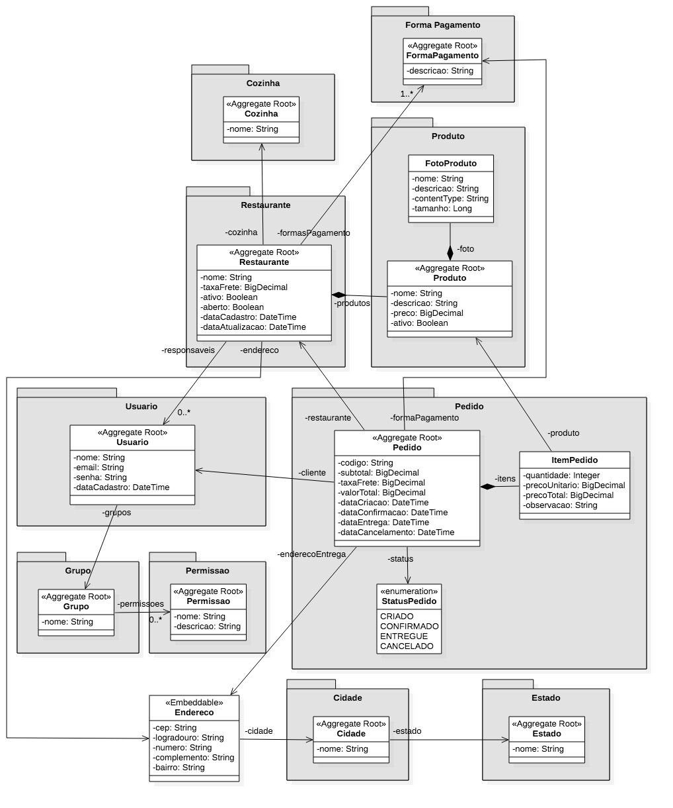

# Food delivery API
Projeto desenvolvido como parte do curso **Especialista Spring REST** oferecido pela [AlgaWorks](https://www.algaworks.com).

## Tecnologias utilizadas

- **Java** 
- **Spring Boot**
    - **Spring Data JPA**
    - **Spring Web**
- **Maven** 
- **MySQL**

## Convenção de Mensagem de Confirmação

Este projeto segue uma convenção específica para mensagens de commit para garantir clareza e consistência no histórico de commits. Abaixo está uma explicação sucinta do padrão utilizado:

## Diagrama de classes de domínio



### Estrutura da Mensagem de Commit

A estrutura das mensagens de commit segue o formato:

```<type>(<scope>): <short summary>```

#### Tipos

- **`feat`**: Nova funcionalidade
- **`fix`**: Correção de um bug
- **`docs`**: Atualização de documentação
- **`style`**: Alterações que não afetam o código (ex: formatação, pontuação)
- **`refactor`**: Alteração do código que não corrige um bug nem adiciona uma funcionalidade
- **`perf`**: Melhorias de desempenho
- **`test`**: Adição ou correção de testes
- **`chore`**: Atualizações de manutenção e configuração (ex: alterações em arquivos de configuração, scripts)

#### Escopos

Os escopos são usados para descrever a área do código afetada pela alteração. Exemplos de escopos incluem:

- **`test-data-load`**: Relacionado ao carregamento de dados para testes

#### Mensagem

A mensagem deve ser uma descrição breve da alteração, escrita em tempo presente e não deve ter ponto final. Use a seguinte estrutura para a mensagem:


**Exemplos:**

- `chore(test-data-load): Update initial SQL file - add inserts for table XPTO`
- `fix(test-data-load): Correct syntax in SQL file for table XYZ`

### Referência

Para mais detalhes sobre a convenção de mensagens de commit, consulte [Angular Commit Message Conventions](https://github.com/angular/angular/blob/main/CONTRIBUTING.md#commit).