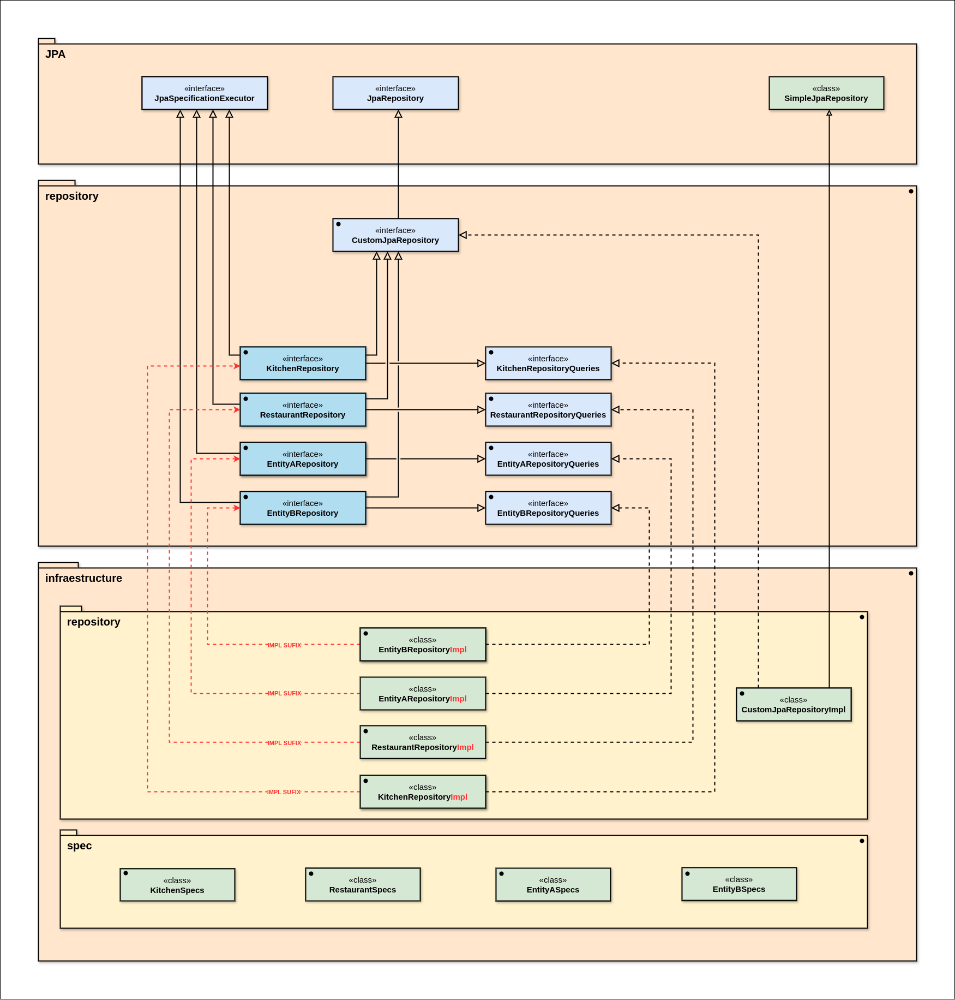
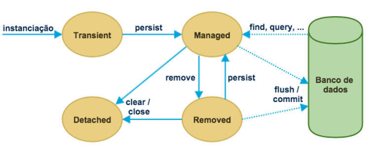

[**<< Voltar ao README**](../README.md#documentação-de-conceitos)

# Persitência e acesso aos dados do banco de dados

Este documento descreve os conceitos e tecnologias estudados e aplicados no contexto de persistência e acesso a bancos de dados no projeto.

## Tecnologias utilizadas: 

- JPA
    - JPQL
    - Criteria API
- Spring Data JPA (SDJPA)
    - Query Methods
    - Native Queries
    - Facilitando o uso de JQPL
    - Specifications
  
## Técnicas abordadas:
- Mapeamento Objeto Relacional (ORM)
- Uso dos recursos do SDJPA criando repositórios abstraídos
- Criação de reposítórios customizados com métodos genéricos para todas as entidades
- Criação de reposítórios customizados para entidades específicas
- Consultas com filtros dinâmicos usando JPQL
- Criando filtros reutilizáveis usando Specifications do SDJPA

## Diagrama de classes da persistencia de dados


###### legenda
- **Azul:** Interfaces
  - **Azul escuro:** Ponto de partida para o uso de todos os métodos
- **Verde:** Classes
- **Seta trastejada:** Implementação
  - **Seta trastejada vermelha:** Implementação oculta realizada apartir do sufixo **Impl**
- **Seta contínua:** Herança

Este diagrama é uma representação gráfica do relacionamento entre classes e interfaces a ser utilizado para possibilitar o uso de
ambas as opções de criação de consultas banco de dados de maneira abstraída.
<br><br>
Com essa modelagem é possível utilizar:

- Query Methods
- Native Query
- JPQL
- Criteria API
- Specifications
- Repositórios customizados genéricos
- Repositórios customizados de entidades específicas.


A arquitetura apresentada pode parecer exagerada, mas possibilita que todos os métodos disponíveis tanto
pelo Spring Data JPA quanto métodos criados manualmente, sejam acessíveis a partir de um único ponto, a **interface repository de cada entidade**(cor azul escuro).

## Conceitos

### Tecnologias
- **JPA:** Framework padrão para mapeamento objeto-relacional (ORM) em Java, usado para persistência de dados em bancos de dados relacionais.
- **Spring Data JPA:** Extensão do Spring Framework que facilita o uso da JPA ao fornecer abstrações para criar repositórios e realizar consultas com menos código.

### Recursos
#### Mapeamento objeto relacional - ORM
Uso de anotações do JPA para mapear entidades e seus atributos podendo definir até mesmo os relacionamentos entre as tabelas do banco de dados.

Exemplo:
```Java
  @Entity
  @Table(name = "tb_restaurant")
  public class Restaurant {
  
      @EqualsAndHashCode.Include
      @Id
      @GeneratedValue(strategy = GenerationType.IDENTITY)
      private Long id;
  
      @Column(nullable = false)
      private String name;
  
      @Column(nullable = false)
      private BigDecimal shippingFee;
  
      @Column(nullable = false)
      private Boolean isOpen = true;
  
      @Column(nullable = false)
      private Boolean isActive = true;
  
      @ManyToOne(cascade = CascadeType.REMOVE)
      @JoinColumn(name = "kitchen_id", nullable = false)
      private Kitchen kitchen;
  }
```

[**Significados de cada anotação ORM**](annotations.md#mapeamento-objeto-relacional---orm)

#### Query Methods 
Métodos de consulta derivados automaticamente com base nos nomes dos métodos em repositórios.

```Java
  List<Restaurant> findByName(String name);

  List<Restaurant> findByNameContainingAndKitchenId(String name, Long kitchen);
```

#### Native Queries 

Consultas escritas diretamente em SQL, permitindo uso total dos recursos específicos do banco de dados. O SDJPA faciltia o seu uso
apenas declarando a instrução **SQL** dentro da anotação ``@Query`` com a propriedade ``nativeQuery=true``.

```Java
   @Query(value = "SELECT * FROM tb_restaurants WHERE name = :name", nativeQuery = true)
   List<Restaurant> findByName(String name);
```

#### JPQL 

Linguagem de consulta baseada em objetos, similar ao SQL, mas operando sobre entidades JPA. O SDJPA facilita o seu uso apenas declarando
a instrução **JPQL** dentro na anotação ``@Query``.

```Java
  public List<Restaurant> findByKitchenName(String kitchenName){
      if(!StringUtils.hasLength(kitchenName)){
          throw new IllegalArgumentException("kitchenName param can't null");
      }
  
      CriteriaBuilder builder = manager.getCriteriaBuilder();
      CriteriaQuery<Restaurant> criteria = builder.createQuery(Restaurant.class);
      Root<Restaurant> root = criteria.from(Restaurant.class);
  
      criteria.where(builder.like(root.get("kitchen").get("name"), "%" + kitchenName + "%"));
      TypedQuery<Restaurant> query = manager.createQuery(criteria);
  
      return query.getResultList();
  }
```

#### Criteria API 

API programática para construir consultas dinâmicas em JPQL com segurança em tempo de compilação.

```Java
  public List<Restaurant> findByKitchenName(String kitchenName){
      if(!StringUtils.hasLength(kitchenName)){
          throw new IllegalArgumentException("kitchenName param can't null");
      }
      
      CriteriaBuilder builder = manager.getCriteriaBuilder();
      CriteriaQuery<Restaurant> criteria = builder.createQuery(Restaurant.class);
      Root<Restaurant> root = criteria.from(Restaurant.class);
      
      criteria.where(builder.like(root.get("kitchen").get("name"), "%" + kitchenName + "%"));
      TypedQuery<Restaurant> query = manager.createQuery(criteria);
      
      return query.getResultList();
  }
```
#### Specifications 

Abstração do Spring Data JPA para criar consultas reutilizáveis e dinâmicas com critérios combináveis.
  - Repositório principal
    ```Java
      @Repository
      public interface RestaurantRepository extends JpaSpecificationExecutor<Restaurant> {}
    ```
  - Classe fábrica de specifications
    ```Java
      public class RestaurantSpecs {
          //A lambada no return implementa o metodo toPredicate() da interface Specification
      
          public static Specification<Restaurant> withFreeShipping(){
              return (root, query, builder) ->
                      builder.equal(root.get("shippingFee"), BigDecimal.ZERO);
          }
      
          public static Specification<Restaurant> withSimilarName(String name){
              return (root, query, builder) ->
                      builder.like(root.get("name"), "%" + name + "%");
          }
      }
    ```
  - Uso dos métodos de specifications
    ```
      public List<Restaurant> findWithFreeShipping(String name) {
          return restaurantRepository.findAll(withFreeShipping().and(withSimilarName(name)));
      }
    ```
### Estratégias
- **Repositórios customizados:** Implementações específicas para adicionar funcionalidades adicionais a repositórios padrão, tanto genéricos quanto focados em entidades específicas.
- **Adicionar lógica durante eventos do ciclo de vida de uma entidade:** Usar anotações JPA para definir lógicas a serem executadas antes das operações de 
registro, atualização e remoção de entidades do banco do banco de dados. [Conferir anotações](annotations.md#anotações-de-ciclo-de-vida-do-jpa).
- **Realizar commit ou rollback:** Usar a anotação ``@Transactional`` para realizar rollbacks em caso de erro na persistencia de dados. [Conferir anotação](annotations.md#spring-framework)
- **Automatizar campos atributos de data:** Utilizar as anotações ``@CreationTimestamp`` e ``@UpdateTimestamp`` para preencher campos de data de criação e atualização de entidades. [Conferir anotações](annotations.md#hibernate).
- **Configurações no arquivo application.properties:**
- **Relacionamentos entre as entidades**: Usar anotações do JPA (``@ManyToOne``, ``@OneToMany``, ``@ManyToMany``, ``@Embedded``). [Conferir anotações](annotations.md#mapeamento-objeto-relacional---orm)
- **Problema N + 1**:
  - stratégia 1: Usar JQPL com fech nos joins
  - Utilizar os carregamentos EAGER e LAZY para diminuir a quantidade de selects desnecessários.


```properties
  spring.datasource.url=jdbc:mysql://localhost:3306/algafood?createDatabaseIfNotExist=true
  spring.datasource.username=root
  spring.datasource.password=123456
  
  
  spring.jpa.properties.hibernate.jdbc.time_zone=UTC
  
  spring.jpa.generate-ddl=true
  spring.jpa.hibernate.ddl-auto=create
  spring.jpa.show-sql=true
  spring.jpa.properties.hibernate.dialect=org.hibernate.dialect.MySQLDialect
```
**[Conferir o significado de cada propriedade](application-properties-file.md)**


## Estados de uma entidade
Uma entidade pode assumir alguns estados com relação ao EntityManager. Os estados podem ser:
- Novo (new ou transient)
- Gerenciado (managed)
- Removido (removed)
- Desanexado (detached)

O estado “novo” é o mais natural. É simplesmente quando construímos um objeto qualquer usando o operador ```new```.

Para estar no estado “gerenciado”, podemos chamar os métodos ```persist```, merge ou buscar a entidade usando o ```EntityManager```.

O estado “removido” é alcançado quando chamamos o método ```remove```.

Por último, uma entidade fica no estado “desanexado” quando é passada para o método ```detach```.

Obs: Importante notar que entidades desanexadas podem voltar a ser gerenciadas com a chamada do método ```merge```

Veja como fica no diagrama abaixo.




## Pool de conexões

Quando um software mantém uma quantidade configurável de conexões abertas e ociosas com o banco de dados e escala e derruba mais à medida que for necessário.

- É posssível configurar as quantidades máxima e mínima de conexões abertas.
- Também é possível configurar por quanto tempo as novas conexões abertas pelo pool se manterão disponíveis, sendo apenas um tempo sugestivo pois o Hikari pode demorar um pouco mais.
- Não existe uma quantidade ideal de conexões a serem configuradas, porém existem algumas sugestões
  - Alguns indicam o dobro da quantidade de núcleos do processador. Mas é apenas uma sugestão.
  - A Oracle ([por meio desse artigo](https://docs.oracle.com/en/database/oracle/oracle-database/19/jjucp/optimizing-real-world-performance.html#GUID-BC09F045-5D80-4AF5-93F5-FEF0531E0E1D)) recomenda de 1 a 10 conexões por core da CPU do servidor de banco de dados.
  - Outros recomendam também que o número máximo de conexões seja igual ao número máximo do Thread Pool do seu servidor. Pois assim evita que threads fiquem presas esperando por conexões de outras.
  - Por padrão o Spring configura 10 conexões para o máximo e mínimo.
  - Veja [aqui](application-properties-file.md#dinifir-configurações-do-pool-de-conexões-padrão-do-spring-hikaricp) como realizar tais configurações.
- Para determinar de fato, é necessários realizar análises a partir de testes de carga em ambientes próximos ao de produção.
- As requisições além da quantidade de conexões ativas, ficam em uma fila a espera da disponibilidade de uma conexão que esteja em uso.


### Links úteis
##### Algaworks
- [**Tutorial definitivo: Tudo o que você precisa para começar bem com JPA**](https://blog.algaworks.com/tutorial-jpa/)
- [**Entendendo o Lock Otimista do JPA (Integridade)**](https://blog.algaworks.com/entendendo-o-lock-otimista-do-jpa/)

##### Baeldung
- [**Propagação e isolamento de transações no Spring**](https://www.baeldung.com/spring-transactional-propagation-isolation)
- [**Introdução ao Hikari**](https://www.baeldung.com/hikaricp)
- [**Auditoria com JPA, Hibernate e Spring Data JPA**](https://www.baeldung.com/database-auditing-jpa)

##### Spring
- [**Documentação Spring Data JPA**](https://spring.io/projects/spring-data-jpa)
- [**Documentação Query Methods**](https://docs.spring.io/spring-data/jpa/reference/jpa/query-methods.html)

##### Outros
- [**Qual é a diferença entre INNER JOIN e OUTER JOIN?**](https://pt.stackoverflow.com/questions/6441/qual-%C3%A9-a-diferen%C3%A7a-entre-inner-join-e-outer-join)
- [**Preventing MySQL Error 1040: Too Many Connections**](https://www.percona.com/blog/preventing-mysql-error-1040-too-many-connections/#:~:text=By%20default%20151%20is%20the,in%20use%20by%20other%20clients)
- [**Otimização do desempenho no mundo real com pools de conexões estáticas**](https://docs.oracle.com/en/database/oracle/oracle-database/19/jjucp/optimizing-real-world-performance.html#GUID-BC09F045-5D80-4AF5-93F5-FEF0531E0E1D)
- [**Repositório do HikariCP**](https://github.com/brettwooldridge/HikariCP)


[**<< Voltar ao README**](../README.md#documentação-de-conceitos)